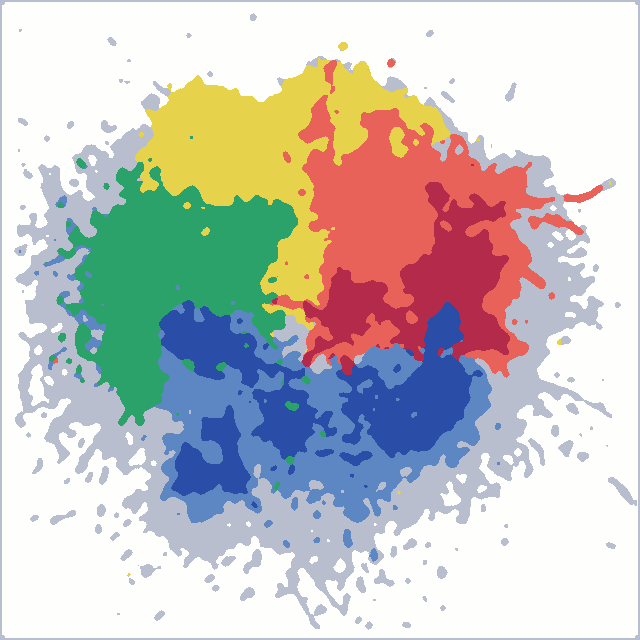
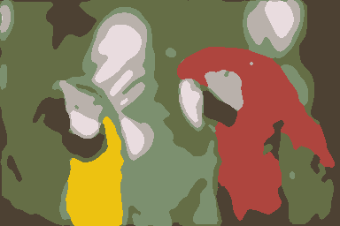
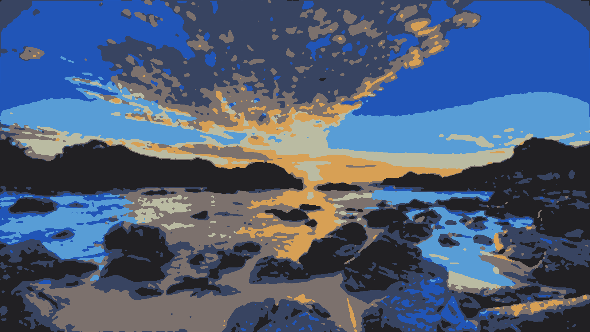

# cmkv project

This project aims to reduce a image size by reducing the space of colors it is using and also reducing the number of small areas of same color.
It reads PNG file format and writes PNG file format.

## How it works

### KMeans clustering

The first step of the algorithm is to do a KMeans over the colors used in the image to clasify them in 8 clusters. Those clusters centroids will be the colors used in the image.

This choice was made because of the hight fidelity a generated image can have, whereas using the 8 basic colors (black, red, blue, green, cyan, magenta, yellow and white) has a very low fidelity when it comes to generating images with very few different colors (a landscape will have a lot of green, and a beach a lot of blue).

The KMeans isolates the 8 dominating colors of the pictures, and those will be the reference colors to use when reducting all used colors to these.

### Blurring

To reduce the amount of residual pixels in the edges of the image, a blurring is applied with a kernel of 7 * 7 by default around the pixels. This allows to have smoother edge when generating the new image.

### Mapping

Once the image is blurred, it is also mapped to be displayed with the 8 colors of the clusters. Each pixel is mapped with its closest cluster.

### Max-Pooling

The max pooling isn't actually a max-pooling like the ones used in convolution, but a max pooling that will overwrite a pixel with the most present pixel around him, and also in a 7*7 kernel by default.

Since at this point there are only 8 colors, the pixel will be the color of the most present color around him, to avoid residual pixels and small chunks of colors and smooth the image.


Once all of those steps are done, the image is generated and written

## How to use

To use the program, just type

```bash
$ make
```
in the root of the project. This will generate a binary _cmkv_.
To use it, do as follow:

```bash
$ ./cmkv <in.png> <out.png>
```

You can also set the number of different colors allowed and the kernel_size, which will be how much the image is blurred and the imperfections are smoothen:
```bash
$ ./cmkv -c <colors> -k <kernel_size> <in.png> <out.png>
$ ./cmkv --colors <colors> --kernel <kernel_size> <in.png> <out.png>
```
Those options can be passed anywhere in the command line, but the flag must precede the value. The defaults values are 8 for colors and 7 for kernel size.

This will take _in.png_ and generate the _out.png_ image as a result of color clustering and size reducing.

## Examples

Here are some examples






